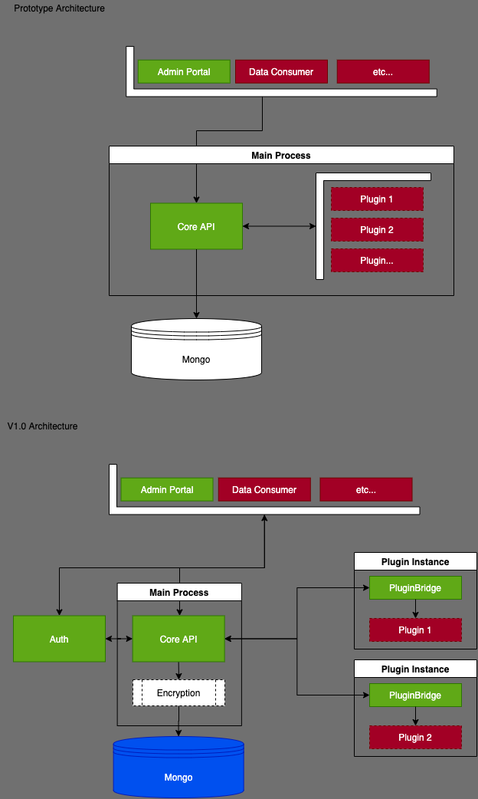

## Architecture

### Design Goals

* Build an easy to deploy system, for instance on a personal RaspberryPi or cloud VM
* Provide adequate security as part of the default configuration
* Support easy extensibility through open source and community sourced plugins
* Provide (the good kind of) hackability by users and developers

### Architectural design and future development

Given this project is designed to aggregate your personal data, including particularly sensitive data such as financial records, a secure architecture is required.

The prototype architecture has some clear security issues, such as:

* 3rd party plugins are running in the main process, giving them environment and code access to any configuration, such as Database credentials. For an open system where plugins might not be trustable, beyond their implicit trust connecting to a particular provider, this opens a world of security issues.
* Data is stored unencrypted in the database, meaning a compromised database would also compromise the data
* The API is not secured at all.

The v1.0 architecture addresses these issues by:

* Separating plugins out into their own instances via a PluginBridge, which could be run on a local machine, or dockerised, or on remote machines. The only true requirement will be network access between the two
* Adding an encryption layer to all API access. This does mean a Data Consumer would need to go through the API using an API key system, but this is a sensible tradeoff.
* Securing the API behind an authentication provider. 

